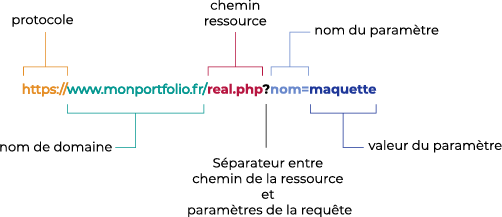

# PHP_COURS
## Transmettre des données via l'URL
### Création d'une URL 
**URL : Uniform Resource Locator** *(Localisateur uniforme de ressource)*
Une URL est utilisé quand un navigateur fait une requête vers un serveur pour une ressource(document HTML, image, vidéo...)

**Une URL est composé de 3 composants**

1. **Protocole** : Il indique au navigateur le protocole qui doit être utilisé pour accéder à la ressource. HTTP(sans SSL) ou HTTPS (avec SSL)
2. **Nom de domaine** : Il permet d'indiquer le serveur web qui détient la ressource. Cela peut être aussi une adresse IP et également suivi d'un port *Ex: 192.168.0.1:80*
3. **Chemin** *(path)* : Il indique le chemin de la ressource sur le serveur web 

<br>
<p align="center">
    
</p>
<br>

*Informations supplémentaires <https://developer.mozilla.org/fr/docs/Apprendre/Comprendre_les_URL>*

### Ajouter un paramètre à une URL

Dans l'exemple ci-dessous nous allons créer un lien vers la page film.php en passant un paramètre "titre" avec pour valeur "goonies".

```html
<a href="film.php?titre=goonies">The Goonies</a>
```

### Ajouter plusieurs paramètres à une URL

Pour ajouter plusieurs paramètres il suffit de les séparer par un **&**, dans l'exemple ci-dessous nous allons envoyer trois paramètres.

```html
<a href="film.php?titre=goonies&likes=100&dislikes=0">The Goonies</a>
```

### Récupérer les données des paramètres

Pour récupérer les données de paramètres nous allons utiliser la variable SuperGlobal **$_GET**. Cette variable nous retournera un tableau associatif. Les clefs de ce tableau associatif seront les noms des paramètres de l'URL.

Pour le lien ci-dessous :

```html
<a href="film?php?titre=goonies&likes=100&dislikes=0">The Goonies</a>
```

Nous aurons :

```php
<?php
    $_GET = [
        'titre' => 'goonies',
        'likes' => '100',
        'dislikes' => '0'
    ];
```

**Attention** les données des paramètres peuvent être modifiées par l'utilisateur. Avant de les utiliser il faudra les traiter.
**Ne jamais faire confiance à l'utilisateur.**

## Transmettre des donnée via un formulaire

### Création d'un formulaire

Pour créer un formulaire nous utiliserons la balise `<form>`, elle prend deux attributs qui sont `action` et `method`

* `action` sera l'URI qui traitera les informations envoyées par le formulaire.
* `method`cette attribut permettra de déterminer la méthode HTTP qui sera utilisé pour envoyer les informations au serveur. GET ou POST

Exemple : 

```html
<form action="traitement.php" method="POST">
    <label for="prenom">Prenom :</label>
    <input type="text" name="prenom" id="prenom" placeholder="votre prenom">
    <label for="email">E-mail :</label>
    <input type="email" name="email" id="email" placeholder="email">
    <p>Votre sexe :</p>
    <div>
        <input id="homme" type="radio" name="sexe" value="H">
        <label for="homme">Homme</label>
    </div>
    <div>
        <input id="femme" type="radio" name="sexe" value="F">
        <label for="femme">Femme</label>
    </div>  
    <p>Votre pays :</p>
    <select name="pays">
        <option value="allemagne">Allemagne</option>
        <option value="angleterre">Angleterre</option>
        <option value="france">France</option>
        <option value="suede">Suède</option>
    </select>
    <div>
        <p>Hobbies : </p>
        <label for="cinema">Cinéma : </label>
        <input id="cinema" name="hobbies[]" type="checkbox" value="cinema">
        <label for="skateboard">Skateboard : </label>
        <input id="skateboard" name="hobbies[]" type="checkbox" value="Skateboard">
        <label for="musique">Musique : </label>
        <input id="musique" name="hobbies[]" type="checkbox" value="musique"> 
    </div>
    <button type="submit">S'inscrire</button>
</form>
```

L'attribut `name` des champs de saisie *(input, select, ...)* est obligatoire, la valeur de cet attribut sera notre clef(indice) dans le tableau associatif de la SuperGlobal `$_POST`. L'attribut `value` n'est pas obligatoire sauf pour certains champs de saisies ou pour pré-remplir nos champs de saisies. L'attribut `value` sera obligatoire pour les champs de saisies : `<input type="radio">`, `<input type="checkbox">` et les `<option>` des balises `<select>`. 

Pour les checkbox la valeur de l'attribut `name` sera un tableau : 
```html 
<label for="cinema">Cinéma : </label>
<input id="cinema" name="hobbies[]" type="checkbox" value="cinema">
<label for="skateboard">Skateboard : </label>
<input id="skateboard" name="hobbies[]" type="checkbox" value="Skateboard">
<label for="musique">Musique : </label>
<input id="musique" name="hobbies[]" type="checkbox" value="musique"> 
```

### Récupèrer les données

Pour récupérer les données nous allons utiliser la SuperGlobal `$_POST`. Pour le formulaire ci-dessus nous obtiendrons :

```php
$_POST = [
    'prenom' => 'Jean',
    'email'= > 'jean@gmail.com',
    'sexe' => 'H',
    'pays' => 'france',
    'hobbies' => [
        '0' => 'cinema',
        '1' => 'skateboard'
    ]
];
